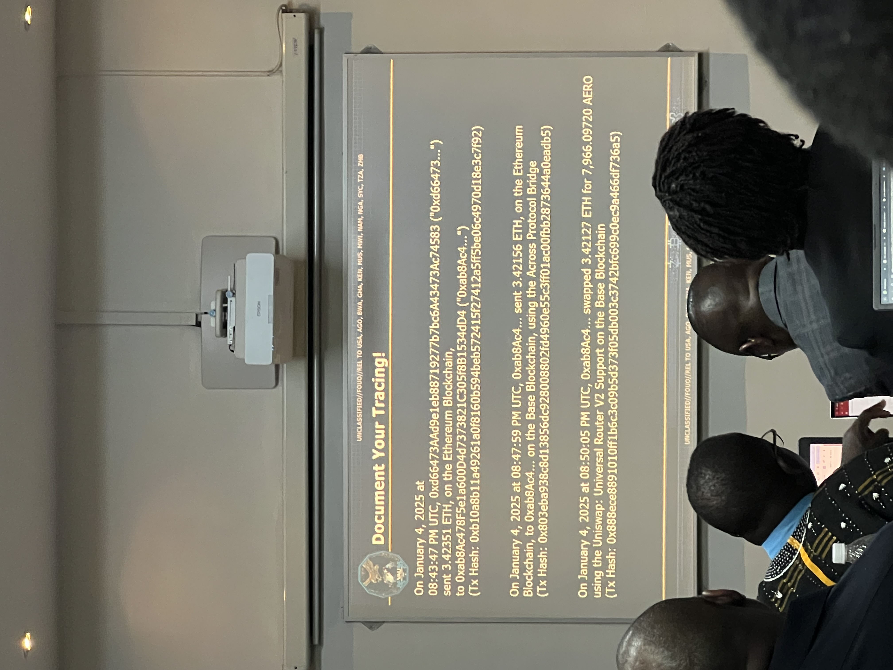

# FBI Presentation

# Intro to Virtual Currency Tracing Investigative Basics and Theory

1. The US has the [IC3](https://www.ic3.gov/) Database
    1. They run it through the database to see what reporting

---

## Bitcoin Basics

- Tracing Bitcoin Basics
    1. Change Address Analysis
    2. Metadata Analysis
    3. If you are co-spending then you are owning
        1. The addresses belong to the same individual
- Example
    
    
    
    
    
    - Writing Example
        
        
        

## Account Based Blockchains

1. Altcoins (Eth)
2. Anything not in Bitcoin Blockchain

## Question 1

1. Trace the flow for this transaction Hash

```bash
0xb10a8b11a49261a0f8160b594beb572415f27412a5ff5be06c4970d18e3c7f92
```


### Documentation



---

## Cryptocurrency Artifacts

<aside>
⚠️

What to search for during search warrant

</aside>

### What are Cryptocurrency Artifacts

(Add the image from photos)

### Cold Storage Devices

(Search the latest cold storage devices online)

## Proof of Wallets Being Used

- Look for applications on the suspects mobile phone
    - Wallet Applications
    - CEX Applications
    - DEX Applications
- Desktop Applications
- Browser Extensions
- Images of extractions
    - On cloud platforms
- Common File Types
    - .dat
    - .wallet
    - .JSON
    - .KEYS
- Recovery Seed Phrases
- Anywhere?
    - Email Accounts
    - Text Files
    - Pieces of Paper
- Private Keys
    - Refer to Investigating Cryptocurrency by Nick
    - Show how to create a script to search for Cryptocurrency Phrases

## When you find seed phrase, How to recover?

- Chainalysis has a tool to derive the Private key from it
- There is a free tool capable of identifying it

## Blocking USDC

- Utilize [CIRCLE](https://www.circle.com/usdc)
- Can consider a Freeze
- They will evaluate

## Freezing and Seizes with [PAXOS](https://www.paxos.com/)

- It has the ability to freeze and seize the ERC-20 tokens in manages on the Ethereum blockchain

## Where can USDT be Frozen?

(Check images)

## US Seizure Warrant + Freeze

- They will freeze with the above services and prepare the Seizure Warrant
- They never extend a freeze
- (Look up how we can do a seizure warrant)

# How to Tether Freeze

1. We come to an address and it has a Tether value (USDT) and we want to freeze
2. Send TETHER and email and describe the case and what you want to freeze and they can freeze them on the Ethereum blockchain
    1. They will freeze
3. Go to [Dune.com](https://dune.com/home)
    1. It has the frozen Tether addresses on the ETH blockchain
    2. Scroll down and you will see all of the ETH addresses with Tether in them.
    3. You can query them about the addresses also

# T3 Private Collaboration

- Resource: https://www.trmlabs.com/resources/blog/t3-financial-crime-unit-marks-enforcement-victory-100-million-in-criminal-assets-frozen-across-five-continents
- If you need assistance you can send email to: [T3FCU@trmlabs.com](mailto:T3FCU@trmlabs.com)
- [TRM, TETHER, TRON](https://www.trmlabs.com/resources/blog/t3-financial-crime-unit-launches-t3-global-collaborator-program-over-250m-in-criminal-assets-frozen-as-binance-becomes-first-member)
- Private Collaboration
- As Law enforcement we can send leads on addresses that they can freeze

# Pre-Seizure Planning

- To do a day before the seizure
- Typically a day
- (Look at the images)

# Seizing from a Private Wallet

(Import Images)

# Seizing from an Exchange

(check images)

# Evidence Considerations

(Check Images)