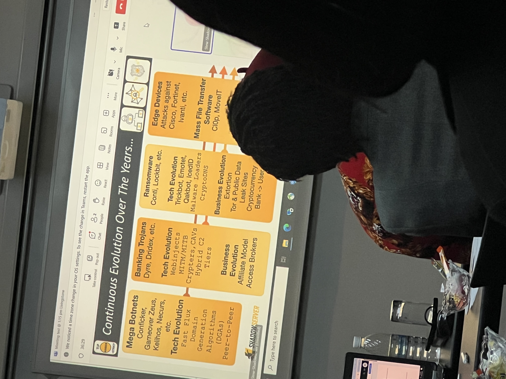

# Shadow Server Presentation

**Host: Stewart Garrick**

### Scanning a Country:

 https://dashboard.shadowserver.org/#sinkhole

### Subscribing to Intelligence

1. Go to shadowserver.org
2. Click on the following
    
    
    
3. Fill in the forms and they will provide contact from there on

---

- The traffic light protocol
    1. Overseas the CERT over the globe
    2. Easy for information sharing
- Purpose
    - Help the internet be more secure and safe
    - They give the data away at free costs
    - Largest data provider over the internet in the world
- Who takes the Data?
    - CERTs
    - Over the globe
    - about 175 Countries
    - about 9000 entities
- How they collect data
    - They scan all IPv4 Addresses
    - Scan IPv6 addresses
    - Collect the IP Address and the Computer who is affected
    - Do not collect Private Data
    - Collect Malware
    - 
- **SSPT**
    - Assist law enforcement with the data that they receive
- How to Share the Data?
    - If the data geolocates the country the data will be provided to that country
- MSSP
    - Can assist entities as a security service provider
    - Assisting law enforcement with certain cases
- Evolution of Cyber Crime
    
    
    
- Open Source Tools
    1. Loopy Loo
- Telegram Scraper
    - https://github.com/CIRCL/AIL-framework/blob/master/HOWTO.md
- How they can help in ransomware cases?
    - https://www.nomoreransom.org/en/decryption-tools.htm
    - https://ransomhunter.com/
- Crypto assistance with case
    - Have details related to suspects in previous cases
    - Can help assist with that
- Principals to incorporate working with Private Sector
    1. Meet people and form trust 
    2. Secure communication channels
        1. PGP Email
        2. Have a platform to share securely