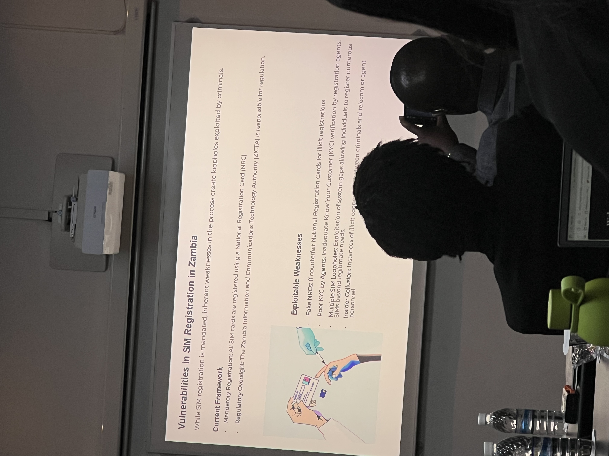

# Zambia Presentation

- STR received linked to VAs
    - 46 and 23
- Trends observed
    - Use of stable coins
    - Use of P2P exchanges and Unlicensed platforms
    - Use of Mixing Services
    - Use of online gaming
    - Addresses linked to fraud shops
    - Email extortion
    - Main one: Client falling prey to
        - Investment Fraud
        - Pig Butchering
        - Romance Scams

---

# Cybercrime and Sim Swap in Zambia

1. Zambia enacted the following act
    1. Cybercrime Act
    2. Cybersecurity Act
2. New Trend in Crime in Zambia
    - SIM Swapping
        1. Illegally take over the phone numbers of victim
        - How it occurs
            1. SIM Cards are replaced
            2. Pre-registered SIM Cards
        - Vulnerabilities in SIM Registration in Zambia
            
            
            
        - Whatsapp Hacking
            - 

# Case

1. 22 Chinese Nationals Case
2. Heritage Coin
3. Chinese Case II